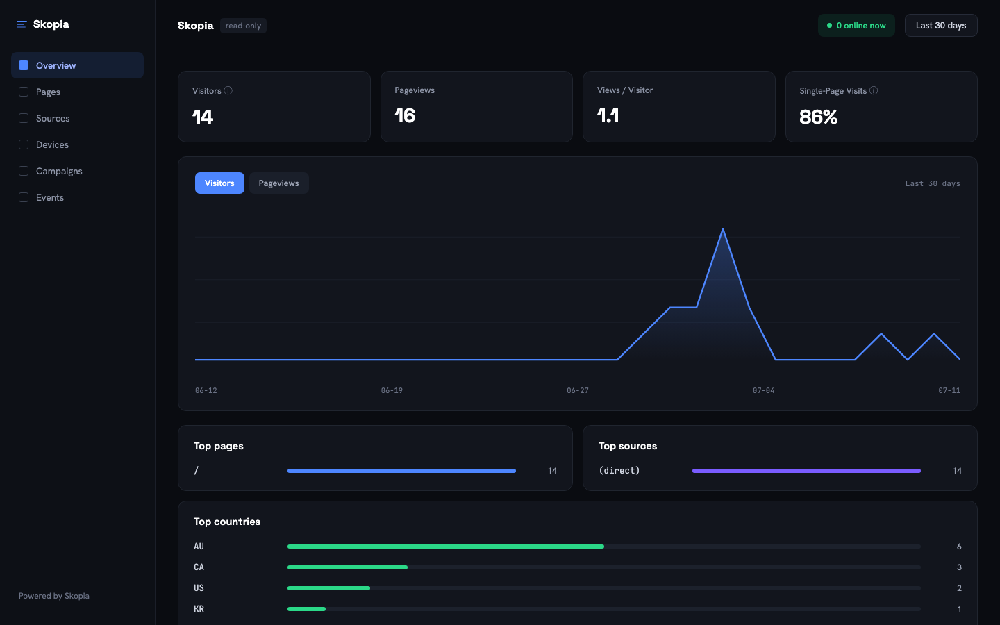

# Skopia

**Open-source, cookieless web analytics you deploy to your own Cloudflare account — the
privacy-first Google Analytics alternative with nothing to run.**

*Skopia* — from the Greek *skopeín*, "to observe."

[](LICENSE)
[](SHARE_URL_PENDING)

<!-- Captured in the release checklist against a real, non-placeholder deployment. -->


- **Cookieless visitor counting, no cookie banner** — a daily-salted HMAC identity, not a
  persistent ID. [How it works →](docs/privacy.md#2-the-visitor-id-precisely)
- **A 571 B gzipped tracking script** (≤ 2 KB budget) —
  [`src/script/skopia.ts`](src/script/skopia.ts), verified by
  [`scripts/check-script-size.mjs`](scripts/check-script-size.mjs), run via `pnpm ci`.
- **Public, read-only share links** — full dashboard views anyone can open logged-out, cached
  at the edge. [Mint one →](docs/install.md#7-public-share-links)
- **Custom events** with low-cardinality props, capped at 512 bytes.
  [Docs →](docs/install.md#6-custom-events)
- **Multi-site in one deploy** — each site gets its own live count, origin allowlist, and
  share link. [Docs →](docs/install.md#4-track-more-than-one-site)
- **Everything lives in your Cloudflare account** — Workers, D1, KV, Durable Objects, Workers
  Analytics Engine. Nothing calls home to the Skopia project, enforced by
  [`scripts/check-no-external.mjs`](scripts/check-no-external.mjs), run via `pnpm ci`.

## Deploy

[](https://deploy.workers.cloudflare.com/?url=https://github.com/jasonm4130/skopia)

One click provisions D1, KV, the `SiteLive` Durable Object, and a Workers Analytics Engine
dataset into *your own* Cloudflare account, then prompts for four secrets. The full
walkthrough — secret generation, the CLI alternative, local dev — lives in the
[install guide](docs/install.md#one-click-deploy).

### Custom domain (optional)

By default your deploy is reachable at `https://skopia.<your-subdomain>.workers.dev`. To
serve it on your own domain, add a **Custom Domain** to the Worker — Cloudflare provisions
the DNS record and TLS certificate automatically. The domain must be in the same Cloudflare
account.

- **Dashboard:** Workers & Pages → your `skopia` Worker → **Settings → Domains & Routes →
  Add → Custom Domain**, then enter your domain (apex or subdomain).
- **Config:** or add a route to your own `wrangler.jsonc` and redeploy:

  ```jsonc
  "routes": [{ "pattern": "analytics.example.com", "custom_domain": true }]
  ```

Keep your own domain out of the upstream `wrangler.jsonc` if you plan to send PRs — the
committed config stays domain-agnostic so the one-click deploy works for everyone.

## Limitations

Skopia trades some things for running cookieless and entirely on Cloudflare. These are owned
tradeoffs, not oversights:

- **WAE sampling.** Workers Analytics Engine — the raw event store — adaptively samples
  queries at high per-site volume. Skopia's daily numbers avoid this: a per-site Durable
  Object writes exact, unsampled aggregates to D1 on every event
  ([ADR-0011](docs/decisions/0011-do-rollup-cutover.md)); only an ad-hoc query against raw
  WAE data is still subject to WAE's own sampling.
- **90-day raw retention.** Cloudflare caps raw Workers Analytics Engine data points at 90
  days — a platform limit, not a Skopia setting. The daily D1 rollups aren't subject to that
  cap and become your durable long-range history once the raw window rolls off
  ([privacy.md §4](docs/privacy.md#4-where-data-lives)).
- **What daily-salt identity can't tell you.** The cookieless visitor hash rotates every UTC
  day, so Skopia can report same-day, same-site uniques but never true monthly unique-visitor
  counts or cross-day conversion attribution (e.g. "visited Monday, converted Thursday") — see
  [privacy.md §3](docs/privacy.md#3-what-this-means-the-site-owner-can-and-cannot-know).
- **The Cloudflare dependency.** Skopia is **self-deployed on your own Cloudflare account**,
  not vendor-neutral software — Workers, D1, KV, Durable Objects, and Workers Analytics Engine
  are all Cloudflare primitives. If you need a different cloud, this isn't that.

## Install

Add the tracking snippet, verify it, track multiple sites, and send custom events — see the
[install guide](docs/install.md).

## Documentation

- [Install guide](docs/install.md) — add the tracking snippet, verify it, track
  multiple sites, send custom events, public share links.
- [Privacy & data collection](docs/privacy.md) — exactly what is and isn't collected, and
  what the daily-salt identity mechanism cannot tell the site owner.
- [Contributing](CONTRIBUTING.md) — dev setup, conventions, the tracking-script budget.
- [Security policy](SECURITY.md) — how to report a vulnerability; the security model.
- [Architecture decisions](docs/decisions/) — the ADRs behind the design.

## Tech stack

- **Cloudflare Workers** — a single Worker serves the collector, the dashboard, and the
  public share surface.
- **D1** (SQLite) — sites, users, and daily rollups (`migrations/`).
- **Workers KV** — the response cache and the daily identity salt.
- **Durable Objects** (`SiteLive`) — event-driven live counts and the unsampled `rollup_daily`
  writer ([ADR-0011](docs/decisions/0011-do-rollup-cutover.md)).
- **Workers Analytics Engine** — the raw, 90-day event store.
- **[Hono](https://hono.dev)** — routing, in the same Worker as everything else.
- **TypeScript**, strict mode. Tests: **Vitest** with
  [`@cloudflare/vitest-pool-workers`](https://github.com/cloudflare/workers-sdk). Lint/format:
  **Biome**.

## Repository layout

```
.claude/agents/   PM + tech-lead agent definitions
design/           Frontend design system (Claude Design source — visual/behavioral spec)
docs/assets/      README/marketing screenshots
docs/research/    Deep-dive research (competitive analysis, Cloudflare architecture)
docs/specs/       Approved design specs
docs/decisions/   Architecture Decision Records (ADRs)
public/           Static assets shipped with the Worker (fonts + vendored jsVectorMap)
src/              Worker source (TypeScript strict)
CLAUDE.md         Operating contract for agents/humans in this repo
```

## Contributing

See [CONTRIBUTING.md](CONTRIBUTING.md) for dev setup, conventions, and the tracking-script
budget rules.

## License

**AGPL-3.0.** Chosen to keep every feature open and unlocked while preventing a closed-source
SaaS fork — see `docs/specs/2026-06-21-product-spec.md` §6.
